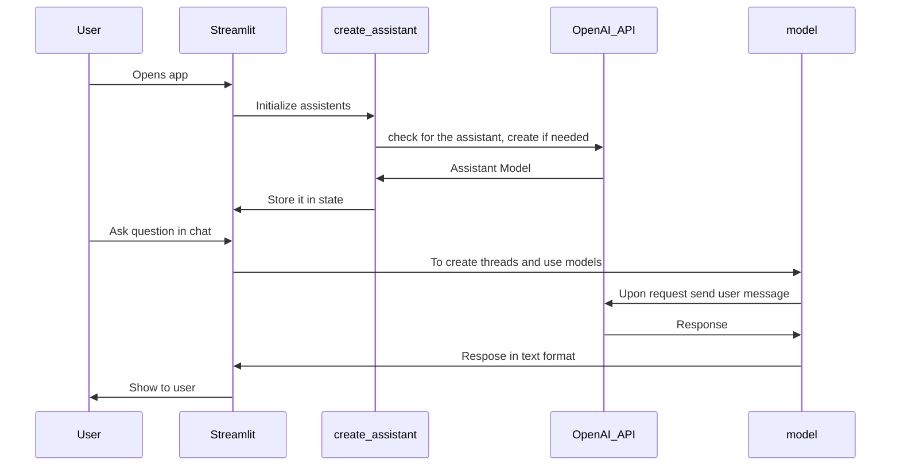

# General Structure

### Folder Structure
```bash
.
├── README.md
├── docs
│   ├── AI Tutor.docx
│   ├── architecture.md
│   └── ~$ Tutor.docx
├── poetry.lock
├── pyproject.toml
├── src
│   ├── Home.py
│   ├── __init__.py
│   ├── __pycache__
│   │   └── config.cpython-310.pyc
│   ├── assistant
│   │   ├── __init__.py
│   │   ├── __pycache__
│   │   │   ├── __init__.cpython-310.pyc
│   │   │   ├── create_assitant.cpython-310.pyc
│   │   │   └── model.cpython-310.pyc
│   │   ├── create_assitant.py
│   │   ├── instructions
│   │   │   ├── debug_helper.txt
│   │   │   ├── feedbackbot.txt
│   │   │   └── socratic_with_hints.txt
│   │   └── model.py
│   ├── config.py
│   └── pages
│       ├── 00_Help.py
│       ├── 01_Debug.py
│       ├── 02_Feedback.py
│       └── __init__.py
└── tasks.py
```

### How the App Works

